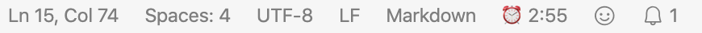
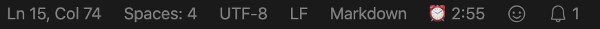

# Yet Another Clock

Display a digital clock in the status bar of VisualStudio Code.
Best for full-screen window as the system clock may be hidden.

[Release Notes](https://github.com/jameslan/vscode-yaclock/releases)

## Features

- Works locally. Do not require to be installed into remote host when using VSCode Remote.
- Simple config. Do not need to learn how to format date time to string in javascript.
Checkbox rules all!
- Adaptive refresh rate. Refresh at the beginning of every second only when needed
(second is displayed or the separator is flashing),
otherwise refresh at the beginning of 0 second every minute.
- No window reload required for any config change.
- Standing out. With a configurable colorful emoji (prefix or postfix),
you could find the time with just a glimpse.
- Show full date time as tool tip of the clock status bar item.
Note that the tooltip appears only when the editor window is focused / activated.

## Tips

- To add [Standard Octicons](https://code.visualstudio.com/api/references/icons-in-labels) into
prefix or postfix, use `$()`, such as `$(clock)`

## Configuration

|Name|Description|Default|
|--------------|---------------|----|
|`yaclock.prefix`|String shown in front of the time.|⏰|
|`yaclock.postfix`|String shown after the time.|
|`yaclock.showSecond`|Display the time with seconds.|`false`|
|`yaclock.flashTimeSeparator`|Flash the time separators|`false`|
|`yaclock.hour12`|Use a 12-hour clock|`false`|
|`yaclock.showDay`|Show the day of the week.|`false`|
|`yaclock.showDate`|Show date.|`false`|
|`yaclock.showAmPm`|Show AM/PM. Will be ignored if in 24 hrs mode.|`false`|
|`yaclock.position`|Position in the status bar.|`right`|
|`yaclock.priority`|Priority. The bigger value, the clock will be closer to the left edge.|`10`|

Icon made by [catkuro](https://www.flaticon.com/authors/catkuro) from [Flaticon](https://www.flaticon.com/)
